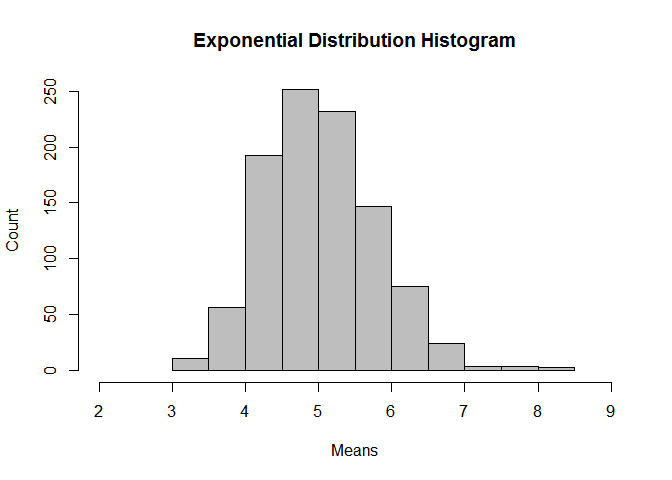
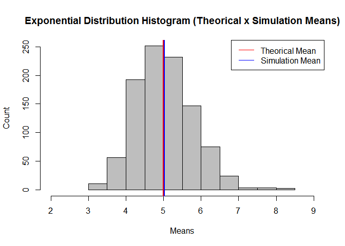
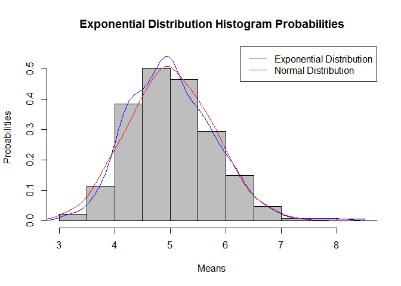

Statistical Inference Project - Part 1
======================================

### by Renato Pedroso Neto

Overview
--------

This part of the project aims to compare the exponential distribution
and the central limit theorem. The comparisons are between mean,
variance and distribution (is this distribution near to normal?).

Simulations
-----------

First we will load the needed libraries to make the comparisons:

    # load all needed libraries
    library(ggplot2, quietly = TRUE)
    library(knitr, quietly = TRUE)

Creating 40 random exponential distribution values for 1000 simulations.
The instructions give the lambda = 0.2:

    # set the seed to make the work reproducible
    set.seed(1010)
    # set the variables as the instructions tell
    simulations <- 1000
    n <- 40
    lambda <- 0.2
    # create the exponential distribution simulation
    simu <- data.frame(matrix(rexp(simulations * n, rate = lambda), simulations, n))
    means <- apply(simu, 1, mean)
    # create a histogram to show the results of the simulation
    hist(means, main = "Exponential Distribution Histogram", 
         xlab = "Means", ylab = "Count", col = "gray",
         xlim = c(2,9))

    # Calculate the theorical mean and variance and the simulation mean and variance
    theorical_mean <- round(1 / lambda, 3)
    theorical_sd <- round((1/lambda)/sqrt(n), 3)
    theorical_variance <- round(theorical_sd ^ 2, 3)
    simu_mean <- round(mean(means), 3)
    simu_sd <- round(sd(means), 3)
    simu_variance <- round(var(means), 3)

After the simulation we can compare:  
The theorical mean is : **5** The simulation mean is: **5.025**  
The theorical standard deviation is : **0.791** The simulation standard
deviation is: **0.773**  
The theorical variance is : **0.626** The simulation variance is:
**0.597**  
As we can see, all the values are pretty close to each other, concluding
that the central limit theorem is valid.

    # Make a plot to visually compare the differences:
    hist(means, main = "Exponential Distribution Histogram (Theorical x Simulation Means)", xlab = "Means", ylab = "Count", col = "gray", xlim = c(2,9))
    abline(v = theorical_mean, lwd = 2, col = "red")
    abline(v = simu_mean, lwd = 2, col = "blue")
    legend("topright", legend = c("Theorical Mean","Simulation Mean"),
           col = c("red","blue"), lty = c(1,1))

Now we can compare the normal distribution to the exponential
distribution:

    set.seed(1010)
    # Make the histogram with probabilities
    hist(means, main = "Exponential Distribution Histogram Probabilities", 
         xlab = "Means", ylab = "Probabilities", col = "gray", prob = TRUE,
         ylim = c(0.0, 0.55))
    lines(density(means), col = "blue")
    # Create 1000 normal random values and plot the line
    normal_values <- rnorm(n = 1000, sd = simu_sd, mean = simu_mean)
    lines(density(normal_values), col = "red")
    legend("topright", legend = c("Exponential Distribution", "Normal Distribution"),
           col = c("blue","red"), lty=c(1,1))

As we can see, the exponential distribution is pretty close to the
normal distribution.
