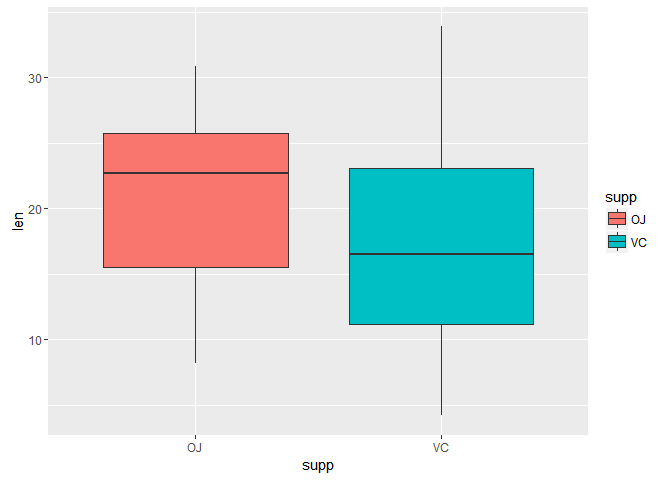
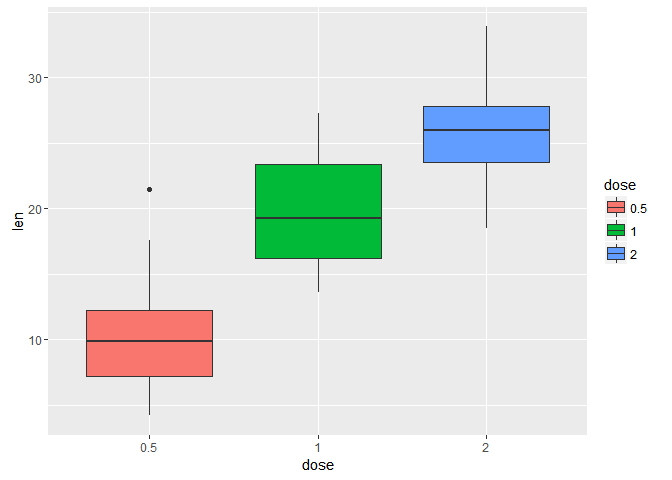

Statistical Inference Project - Part 2
======================================

### by Renato Pedroso Neto

Overview
--------

This part of the project aims to analyse the toothgrowth dataset,
provided by R base packages, making hypothesis testings and assumptions
about possible correlations.

First we need to load the toothgrowth data and make some basic
exploratory analysis:

    library(ggplot2, quietly = TRUE)
    library(dplyr, quietly = TRUE, warn.conflicts = FALSE)
    data("ToothGrowth")
    # transform the dose in factor variable
    ToothGrowth <- mutate(ToothGrowth, dose = as.factor(dose))
    str(ToothGrowth)

    ## 'data.frame':    60 obs. of  3 variables:
    ##  $ len : num  4.2 11.5 7.3 5.8 6.4 10 11.2 11.2 5.2 7 ...
    ##  $ supp: Factor w/ 2 levels "OJ","VC": 2 2 2 2 2 2 2 2 2 2 ...
    ##  $ dose: Factor w/ 3 levels "0.5","1","2": 1 1 1 1 1 1 1 1 1 1 ...

    # basic exploratory analysis. Any NA values?
    sum(complete.cases(ToothGrowth))

    ## [1] 60

    # No NA values!

We can take a look at basic summary of the data as well:

    summary(ToothGrowth)

    ##       len        supp     dose   
    ##  Min.   : 4.20   OJ:30   0.5:20  
    ##  1st Qu.:13.07   VC:30   1  :20  
    ##  Median :19.25           2  :20  
    ##  Mean   :18.81                   
    ##  3rd Qu.:25.27                   
    ##  Max.   :33.90

    head(ToothGrowth, n = 3)

    ##    len supp dose
    ## 1  4.2   VC  0.5
    ## 2 11.5   VC  0.5
    ## 3  7.3   VC  0.5

    # Whats is the behavior of supp and len?
    ggplot(ToothGrowth, aes(x = supp, y = len)) + geom_boxplot(aes(fill=supp))

    # Whats is behavior of dose and len?
    ggplot(ToothGrowth, aes(x = dose, y = len)) + geom_boxplot(aes(fill=dose))

With the preliminaries graphs we could have a sense of behavior of all
the variables. Let's start to create some hypothesis:

**Null Hypothesis 1 - ** The supplement type (orange juice or vitamin c
as ascorbic acid) has **NO** effect on tooth growth.  
**Alternative Hyphotesis 1 - ** The supplement type has effect on tooth
growth.

We can test this hypotheses with the Student's T-Test:

    t.test(ToothGrowth$len ~ ToothGrowth$supp, paired = FALSE)

    ## 
    ##  Welch Two Sample t-test
    ## 
    ## data:  ToothGrowth$len by ToothGrowth$supp
    ## t = 1.9153, df = 55.309, p-value = 0.06063
    ## alternative hypothesis: true difference in means is not equal to 0
    ## 95 percent confidence interval:
    ##  -0.1710156  7.5710156
    ## sample estimates:
    ## mean in group OJ mean in group VC 
    ##         20.66333         16.96333

As we can see we **FAILED** to reject the null hypothesis due to the
high p-value, 0.06, and the confidence interval.

We can test the hypothesis including the dose variable:

**Null Hypothesis 2 - ** The dose of vitamin C has **NO** effect on
tooth growth  
**Alternative Hyphotesis 2 - ** The dose of vitamin c has effect on
tooth growth

    # Separate the doses in groups of two in order to make the t.test
    dose_g1 <- subset(ToothGrowth, dose %in% c(0.5,1))
    dose_g2 <- subset(ToothGrowth, dose %in% c(1,2))
    dose_g3 <- subset(ToothGrowth, dose %in% c(0.5,2))

    t.test(len ~ dose, data = dose_g1)

    ## 
    ##  Welch Two Sample t-test
    ## 
    ## data:  len by dose
    ## t = -6.4766, df = 37.986, p-value = 1.268e-07
    ## alternative hypothesis: true difference in means is not equal to 0
    ## 95 percent confidence interval:
    ##  -11.983781  -6.276219
    ## sample estimates:
    ## mean in group 0.5   mean in group 1 
    ##            10.605            19.735

    t.test(len ~ dose, data = dose_g2)

    ## 
    ##  Welch Two Sample t-test
    ## 
    ## data:  len by dose
    ## t = -4.9005, df = 37.101, p-value = 1.906e-05
    ## alternative hypothesis: true difference in means is not equal to 0
    ## 95 percent confidence interval:
    ##  -8.996481 -3.733519
    ## sample estimates:
    ## mean in group 1 mean in group 2 
    ##          19.735          26.100

    t.test(len ~ dose, data = dose_g3)

    ## 
    ##  Welch Two Sample t-test
    ## 
    ## data:  len by dose
    ## t = -11.799, df = 36.883, p-value = 4.398e-14
    ## alternative hypothesis: true difference in means is not equal to 0
    ## 95 percent confidence interval:
    ##  -18.15617 -12.83383
    ## sample estimates:
    ## mean in group 0.5   mean in group 2 
    ##            10.605            26.100

With this t-test we **SUCCESSFULLY** accepted the alternative hypothesis
due to the confidence interval and low p-values (under 0.05).

Conclusions and Assumptions
---------------------------

As we could see, in the previous studies, we can conclude that
supplement type of vitamin c has **no** effect on tooth growth and a
diet rich in vitamin c by itself **does** help in tooth growth. As the
dosage increases the tooth length increases too.

To make this study we have the assumption of the data to be not paired
and with different variances.  
To make the inference about the population we are assuming that this
sample is enough.
